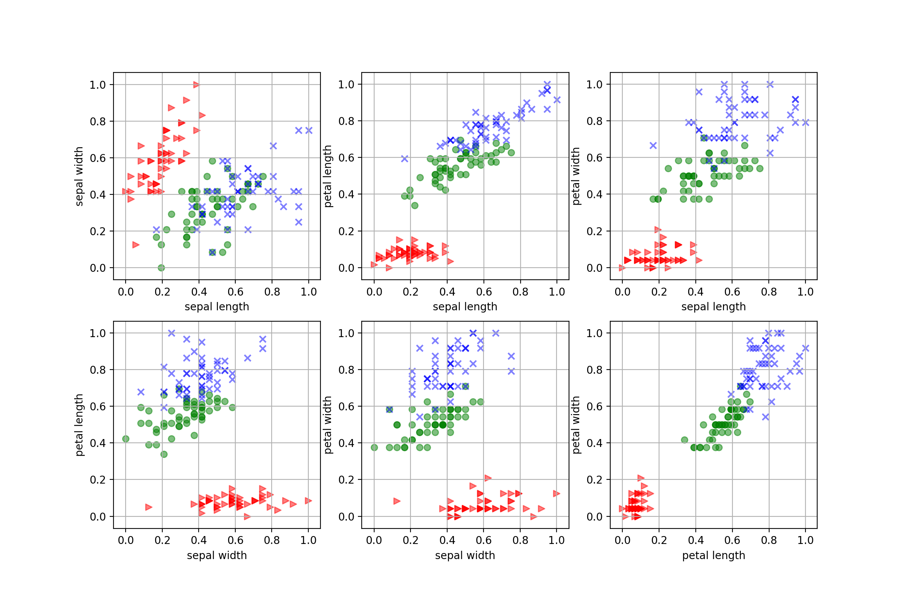
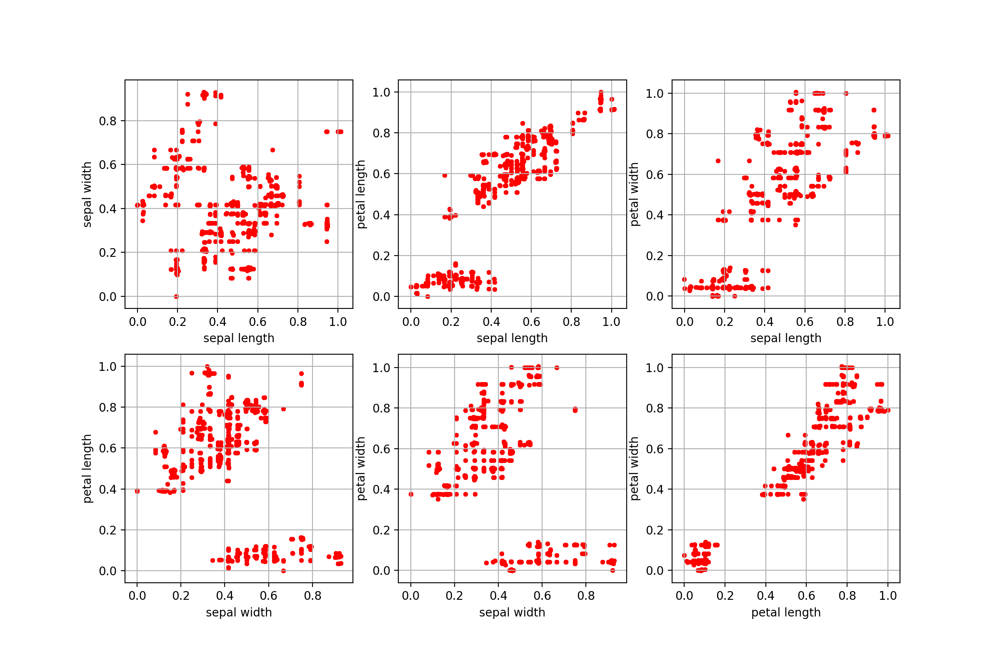

# Model Compression

- http://lapis-zero09.hatenablog.com/entry/2018/03/22/230000
- Bucilua, C., Caruana, R. and Niculescu-Mizil, A.: Model Compression, Proc. ACM SIGKDD, pp. 535–541 (2006).
- https://dl.acm.org/citation.cfm?id=1150464


## MUNGE

### Preparation of data

データは正規化する
> Continuous attributes are linearly scaled to [0,1].


また，101行目から
MUNGEでは各特徴量が連続であるか否かを入力として与える必要がある．

以下は全ての特徴量が連続の場合の例

データに応じて`l`を変更する．

```java
// represent instances attributes for munge
// 0 : continuous
// 1 : other
int[] l = new int[m_numAttr];
Arrays.fill(l, 0);
```


### Run

```sh
cd MUNGE
javac -classpath Extentions/py4j.jar:Extentions/weka.jar MUNGE.java
python munge.py
```

パラメータの設定

108~110行目をいじる

```java
double p = 0.5;
double s = 10;
int k = 1000000;
```

- Input:  `data/data.npy`
- Output: `data/data.arff`


### Result

./MUNGE_example.ipynb

iris data with normalization




synthetic data with MUNGE



## Dependencies

- weka: https://www.cs.waikato.ac.nz/ml/weka/
- py4j: https://www.py4j.org/
